# Zulal Database Schema Diagram

```mermaid
erDiagram
    %% Core Tables
    TENANT {
        uuid id PK
        text name
        text slug
        jsonb settings
        jsonb features
        boolean is_active
    }
    
    USER {
        uuid id PK
        text email
        locale locale
        locale[] preferred_locales
        jsonb metadata
        boolean is_active
        text cio_id
        bigint created_timestamp
    }
    
    USER_TENANT {
        uuid id PK
        uuid user_id FK
        uuid tenant_id FK
        account_type role
        boolean is_primary
        timestamp joined_at
    }
    
    %% Customer Management
    CUSTOMER {
        uuid id PK
        uuid tenant_id FK
        account_type type
        text name
        text description
        uuid default_address_id FK
        uuid owner_id FK
        jsonb metadata
        jsonb settings
        boolean is_active
        text stripe_customer_id
        text external_id
    }
    
    ADDRESS {
        uuid id PK
        uuid tenant_id FK
        uuid customer_id FK
        address_type type
        address_category category
        text line1
        text city
        text country
        text address_hash
    }
    
    BRAND {
        uuid id PK
        uuid tenant_id FK
        uuid customer_id FK
        text name
        text description
        text logo_url
        text website_url
        jsonb settings
        boolean is_active
    }
    
    STORE {
        uuid id PK
        uuid tenant_id FK
        uuid customer_id FK
        text name
        store_type type
        uuid address_id FK
        text website_url
        jsonb settings
        boolean is_active
    }
    
    %% Products & Services
    PRODUCT {
        uuid id PK
        uuid tenant_id FK
        text name
        text slug
        text description
        text sku
        jsonb attributes
        boolean is_active
        text stripe_product_id
        uuid default_price_id FK
    }
    
    PRICE {
        uuid id PK
        uuid tenant_id FK
        uuid product_id FK
        text currency
        numeric unit_amount
        price_type type
        price_interval interval
        integer interval_count
        text stripe_price_id
    }
    
    SERVICE_CATALOG {
        uuid id PK
        uuid tenant_id FK
        service_type service_type
        text name
        text description
        numeric base_price
        price_interval billing_interval
        jsonb features
    }
    
    %% Orders
    ORDER {
        uuid id PK
        uuid tenant_id FK
        uuid customer_id FK
        uuid brand_id FK
        uuid store_id FK
        order_type order_type
        text name
        text description
        numeric total_amount
        text currency
        boolean is_draft
    }
    
    ORDER_ITEM {
        uuid id PK
        uuid tenant_id FK
        uuid order_id FK
        uuid product_id FK
        uuid service_catalog_id FK
        numeric quantity
        numeric unit_price
        numeric total_amount
    }
    
    CAMPAIGN_ORDER {
        uuid id PK
        uuid tenant_id FK
        uuid order_id FK
        service_type service_type
        uuid platform_id FK
        date start_date
        date end_date
        numeric total_budget
        numeric daily_budget
        bigint impressions
        bigint clicks
        bigint conversions
    }
    
    SUBSCRIPTION_ORDER {
        uuid id PK
        uuid tenant_id FK
        uuid order_id FK
        uuid service_catalog_id FK
        date start_date
        date end_date
        date next_billing_date
        price_interval billing_interval
        numeric amount
        text stripe_subscription_id
        boolean auto_renew
    }
    
    %% Financial
    BUDGET {
        uuid id PK
        uuid tenant_id FK
        text name
        text description
        numeric amount
        text currency
        budget_status status
        date start_date
        date end_date
    }
    
    BUDGET_ITEM {
        uuid id PK
        uuid tenant_id FK
        uuid budget_id FK
        uuid customer_id FK
        uuid invoice_item_id FK
        uuid platform_campaign_id FK
        numeric amount
        text currency
        numeric fee
        budget_status status
    }
    
    INVOICE {
        uuid id PK
        uuid tenant_id FK
        uuid customer_id FK
        uuid order_id FK
        text invoice_number
        text description
        text status
        date due_date
        date paid_date
        numeric amount
        text currency
        text stripe_invoice_id
        numeric amount_paid
    }
    
    INVOICE_ITEM {
        uuid id PK
        uuid tenant_id FK
        uuid invoice_id FK
        uuid order_item_id FK
        text description
        numeric quantity
        numeric unit_price
        numeric total_amount
    }
    
    %% Platform Integrations
    PLATFORM {
        uuid id PK
        text name
        text display_name
        text base_url
        text api_version
        boolean is_active
        jsonb capabilities
    }
    
    PLATFORM_CONNECTION {
        uuid id PK
        uuid tenant_id FK
        uuid platform_id FK
        uuid customer_id FK
        uuid brand_id FK
        connection_status status
        text platform_account_id
        timestamp connected_at
    }
    
    PLATFORM_CAMPAIGN {
        uuid id PK
        uuid tenant_id FK
        uuid campaign_order_id FK
        uuid platform_artifact_id FK
        uuid platform_id FK
        text platform_campaign_id
        text name
        text status
        numeric budget
        text currency
        date start_date
        date end_date
    }
    
    %% Relationships
    TENANT ||--o{ USER_TENANT : "has"
    USER ||--o{ USER_TENANT : "belongs to"
    TENANT ||--o{ CUSTOMER : "contains"
    CUSTOMER ||--o{ BRAND : "owns"
    CUSTOMER ||--o{ STORE : "operates"
    CUSTOMER ||--o{ ADDRESS : "has"
    TENANT ||--o{ PRODUCT : "catalogs"
    PRODUCT ||--o{ PRICE : "has"
    CUSTOMER ||--o{ ORDER : "places"
    ORDER ||--o{ ORDER_ITEM : "contains"
    ORDER ||--o| CAMPAIGN_ORDER : "specializes as"
    ORDER ||--o| SUBSCRIPTION_ORDER : "specializes as"
    ORDER ||--o{ INVOICE : "billed through"
    INVOICE ||--o{ INVOICE_ITEM : "contains"
    TENANT ||--o{ BUDGET : "allocates"
    BUDGET ||--o{ BUDGET_ITEM : "itemizes"
    PLATFORM ||--o{ PLATFORM_CONNECTION : "connects to"
    PLATFORM_CONNECTION ||--o{ PLATFORM_CAMPAIGN : "runs"
    CAMPAIGN_ORDER ||--o{ PLATFORM_CAMPAIGN : "implements"
    ORDER_ITEM }o--|| PRODUCT : "refers to"
    ORDER_ITEM }o--|| SERVICE_CATALOG : "refers to"
    SUBSCRIPTION_ORDER }o--|| SERVICE_CATALOG : "subscribes to"
    
    %% Many-to-many relationships
    CUSTOMER ||--o{ PAYMENT_METHOD : "has"
    BUDGET ||--o{ BUDGET_PARTICIPANT : "involves"
    ORDER ||--o{ ORDER_PARTICIPANT : "involves"
    
    %% Security
    PERMISSION_GROUP {
        uuid id PK
        uuid tenant_id FK
        text name
        text description
        boolean is_system
    }
    
    PERMISSION {
        uuid id PK
        uuid tenant_id FK
        uuid permission_group_id FK
        permission_scope scope
        text resource_type
        uuid resource_id
        jsonb conditions
    }
    
    AUTHORIZATION {
        uuid id PK
        uuid tenant_id FK
        uuid user_id FK
        uuid permission_group_id FK
        uuid permission_id FK
        uuid granted_by FK
        timestamp granted_at
        timestamp expires_at
    }
    
    USER ||--o{ AUTHORIZATION : "receives"
    PERMISSION_GROUP ||--o{ PERMISSION : "contains"
    PERMISSION_GROUP ||--o{ AUTHORIZATION : "granted through"
    PERMISSION ||--o{ AUTHORIZATION : "granted directly"
    
    %% Supporting structures
    TENANT ||--o{ NOTIFICATION : "sends"
    TENANT ||--o{ AUDIT_LOG : "records"
    USER }o--o{ NOTIFICATION : "receives"
    
    %% Polymorphic relationships represented as weak connections
    NOTE }o--o{ CUSTOMER : "attaches to"
    NOTE }o--o{ ORDER : "attaches to"
    STATUS_EVENT }o--o{ ORDER : "tracks"
    STATUS_EVENT }o--o{ CAMPAIGN_ORDER : "tracks"
```

The above Mermaid diagram represents the core relationships in the Zulal database schema. Due to the complexity of the full schema, some supporting tables and connections are simplified.

## Key Entity Groups

1. **Multi-tenancy Structure**:
   - Tenant
   - User
   - User_Tenant

2. **Customer Management**:
   - Customer
   - Address
   - Brand
   - Store

3. **Product & Service Catalog**:
   - Product
   - Price
   - Service_Catalog

4. **Order System**:
   - Order (base)
   - Order_Item
   - Campaign_Order
   - Subscription_Order
   - Order_Participant

5. **Financial Management**:
   - Budget
   - Budget_Item
   - Budget_Participant
   - Invoice
   - Invoice_Item
   - Payment_Method

6. **Marketing Platform Integration**:
   - Platform
   - Platform_Connection
   - Platform_Artifact
   - Platform_Campaign

7. **Security & Permissions**:
   - Permission_Group
   - Permission
   - Authorization

8. **Supporting Systems**:
   - Note
   - Notification
   - Status_Event
   - Audit_Log
   - Job
   - Webhook_Event

## Design Patterns

1. **Multi-tenancy**: Tenant_id field on most tables with Row-Level Security
2. **Polymorphic Relationships**: Resource_type/resource_id pattern for generic connections
3. **Soft Deletion**: Deleted_at timestamp rather than physical deletion
4. **Audit Trail**: Created_at/created_by and updated_at/updated_by on all tables
5. **Extensibility**: JSONB metadata fields for flexible schema extension
